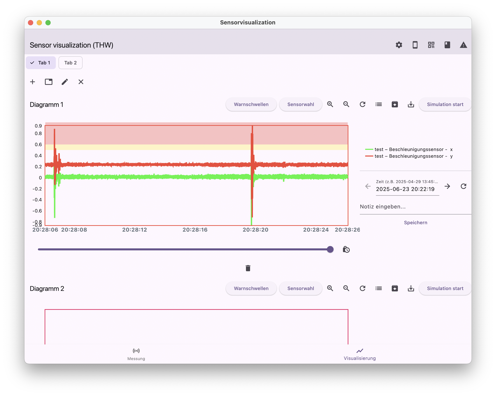

# Visualisierung von Smartphone-Sensordaten
## für Arbeiten im Zivil- und Katastrophenschutz - in Zusammenarbeit mit dem THW

## --English version below--


### Das Smartphone als Multisensorplatform
Was noch vor einigen Jahre ausschließlich Fachanwendern vorbehalten
war, trägt heutzutage jeder in der Hosentasche bei sich.
Die in aktuellen Smartphones verbaute Sensortechnik liefert eine weitaus
größere Vielfalt an Daten, als den meisten Nutzern überhaupt bewusst ist.
Allseits bekannt sind Sensoren zur Positionsbestimmung aus
Satellitendaten oder die Nutzung des Neigungssensors als Wasserwaage,
da deren Daten unmittelbar mit einer gewünschten Funktion in
Verbindung gebracht werden kann.
Sensoren die eher im Hintergrund agieren, wie beispielsweise der
Beschleunigungssensor, das Gyroskop oder das Magnetometer, sind
hingegen oft unbekannt oder werden nur passiv wahrgenommen.
Das Ziel des Projektes „Libelle“ ist es, die im dabei registrierten
Umgebungsdaten einem Anwender so zur Verfügung zu stellen, dass
Smartphones als multifunktionaler Sensor im Kontext einer
Bauwerksüberwachung eingesetzt werden können.

## Projektüberblick
Dieses Projekt wird im Rahmen des Programmierprojekts im Studiengang Informatik an der THWS durchgeführt. Zwei Systeme werden entwickelt: Ein Smartphone übermittelt die aktuellen Messdaten an einen Empfänger, der diese Daten anschließend visuell darstellt.

Zentrale Punkte:
- Darstellung von Graphen aus den Daten der Smartphone-
Sensorik (Neigungsmesser, Beschleunigungsmesser, Kompass, …)
- Visualisierung als Zeit-Messwert-Diagramme
- Verknüpfung verschiedener Datenquellen (im gleichen Diagramm)
- Anpassbare Zeitbereiche (fortlaufend und verschiebbar)
- „Event“-Markierung mit Notizfunktion
- Auf „Null“ setzen der Startwerte
- „Null“-Messung (z.B. 10sek.) zur Ermittlung der Startwerte
- Hinzufügen weiterer Diagramme
- Export (*.csv)
- Plotten der Graphen (zur Dokumentation und Weitergabe mit pdf-Export)
- Definition von Warnschwellen (Alarmierung bei Überschreitung)
- „Systemzeit“ oder „Zeit ab Start“ für die Zeitachse wählbar


## Tech Stack

- **Frontend**: Flutter (Mobile & Web)
- **Database**: SQFLite (lokal) und FireStore-Database


#### Flutter-App starten

```bash
cd flutter_app
flutter pub get
flutter run
```

## Mögliche zukünftige Features

- Frei wählbarer Kombination der Messwerte (mehrere Skalen am Diagrammrand)
- Umrechnung der Messwerte (z.B. Winkeländerung in °Grad oder mm/m)
- "Selbstauslöser" für Handymessung
- Zeit-Anzeige im NATO-Format
- Automatische Alarmierung bei Überschreitung von Grenzwerten

## Projektstruktur

```plaintext
sensorvisualization/
├── lib/
│   ├── controller/    
│   |   ├── measurement/ 
│   |   ├── visualization/ 
│   ├── data/                         
│   |   ├── services/ 
│   │   |   ├── client/ 
│   │   |   ├── providers/ 
│   │   |   ├── server/ 
│   |   ├── settingsModels/ 
│   ├── database/           
│   ├── fireDB/    
│   ├── model/ 
│   |   ├── measurement/ 
│   |   ├── visualization/                
│   ├── presentation/  
│   |   ├── measurement/   
│   |   ├── visualization/
│   |   |   ├── dialogs/
│   |   |   ├── widgets/
│   |   ├── widgets/          
│   └── main.dart       # entry point
├── pubspec.yaml
└── README.md
```

## Screenshots

### Messungs-Screens


### Empfänger-/ Host Screens
</br>


## Contributor

- [Jasmin Wander] https://github.com/xjasx4
- [Sebastian Nagles] https://github.com/SebasN12
- [Tom Knoblach] https://github.com/Gottschalk125
- [Joshua Pfennig] https://github.com/jshProgrammer


</br></br></br></br></br></br>


# Visualization of Smartphone-sensordata
## for work in civil protection and disaster control - in cooperation with the THW

### The Smartphone as a multisensorplatform
What just a few years ago was reserved exclusively for specialist users
was reserved exclusively for specialist users a few years ago, nowadays everyone carries it in their pocket.
The sensor technology built into today's smartphones delivers a far greater
a far greater variety of data than most users are even aware of.
Sensors for determining position from satellite data or the use of
satellite data or using the tilt sensor as a spirit level,
as their data can be directly linked to a desired function.
can be directly associated with a desired function.
Sensors that operate more in the background, such as the acceleration
such as the acceleration sensor, the gyroscope or the magnetometer, are often
are often unknown or only passively perceived.
The aim of the “Libelle” project is to make the environmental
environmental data to a user in such a way that smartphones
smartphones can be used as a multifunctional sensor in the context of
building monitoring.

Translated with DeepL.com (free version)

# Projectoverview
This project is being carried out as part of the programming project in the computer science course at the THWS. Two systems are being developed: A smartphone transmits the current measurement data to a receiver, which then displays this data visually.

Central points:
- Display of graphs from the smartphone data
sensors (inclinometer, accelerometer, compass, ...)
- Visualization as time-measurement diagrams
- Linking of different data sources (in the same diagram)
- Customizable time ranges (continuous and movable)
- “Event” marking with note function
- Setting the start values to “zero"
- “Zero” measurement (e.g. 10 sec.) to determine the start values
- Add further diagrams
- Export (*.csv)
- Plotting of graphs (for documentation and dissemination with pdf export)
- Definition of warning thresholds (alarm if exceeded)
- “System time” or “Time from start” can be selected for the time axis


Translated with DeepL.com (free version)

## Tech Stack

- **Frontend**: Flutter (Mobile & Web)
- **Database**: SQFLite (locally) and FireStore-Database

#### starting Flutter-App 

```bash
cd flutter_app
flutter pub get
flutter run
```


## Possible future features

- Freely selectable combination of measured values (several scales at the edge of the diagram)
- Conversion of the measured values (e.g. angle change in °degrees or mm/m)
- Timer for phone measurement
- Time display in NATO format
- Automatic alarm in case of exceeding limits

## Project structure

```plaintext
sensorvisualization/
├── lib/
│   ├── controller/    
│   |   ├── measurement/ 
│   |   ├── visualization/ 
│   ├── data/                         
│   |   ├── services/ 
│   │   |   ├── client/ 
│   │   |   ├── providers/ 
│   │   |   ├── server/ 
│   |   ├── settingsModels/ 
│   ├── database/           
│   ├── fireDB/    
│   ├── model/ 
│   |   ├── measurement/ 
│   |   ├── visualization/                
│   ├── presentation/  
│   |   ├── measurement/   
│   |   ├── visualization/
│   |   |   ├── dialogs/
│   |   |   ├── widgets/
│   |   ├── widgets/          
│   └── main.dart       # entry point
├── pubspec.yaml
└── README.md
```

## Screenshots

### Measurement Screens


### Recipient/ Host Screens
</br>


## Contributor

- [Jasmin Wander] https://github.com/xjasx4
- [Sebastian Nagles] https://github.com/SebasN12
- [Tom Knoblach] https://github.com/Gottschalk125
- [Joshua Pfennig] https://github.com/jshProgrammer
